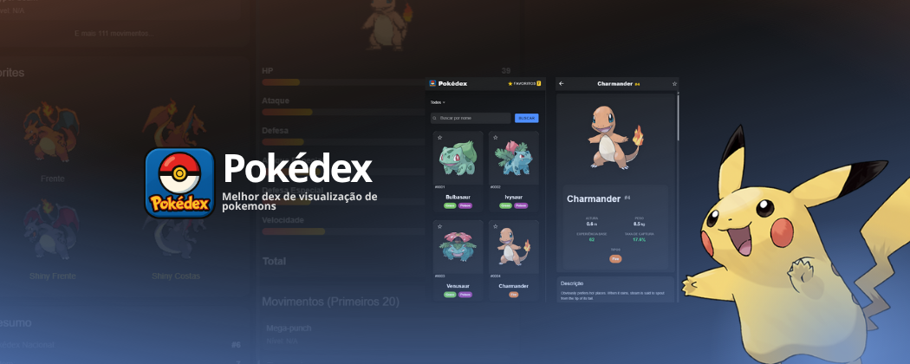
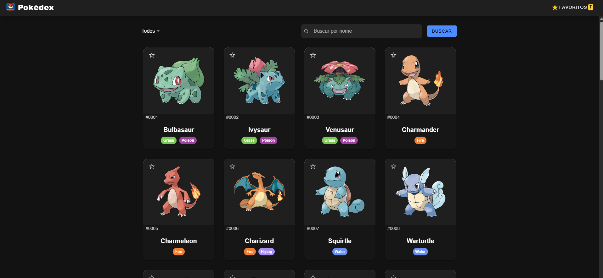
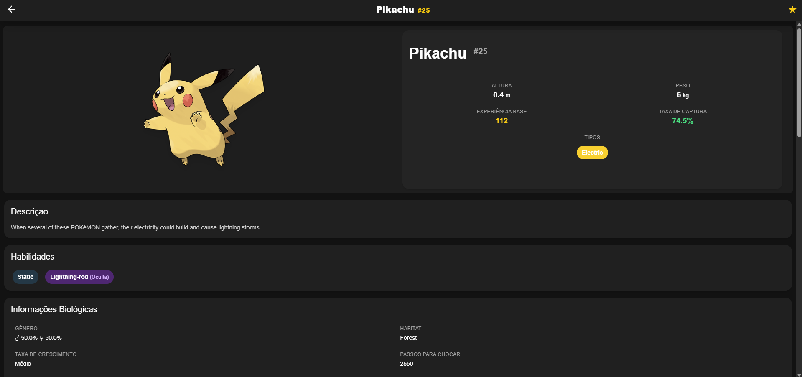
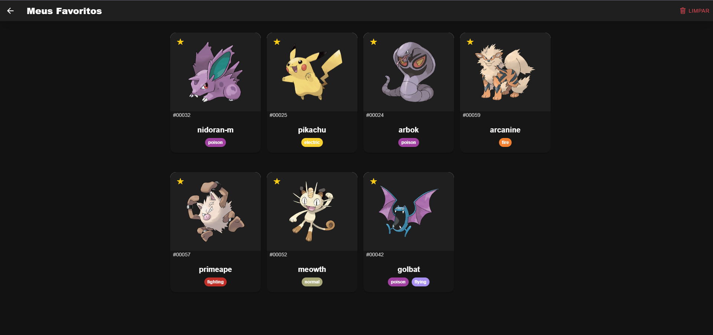
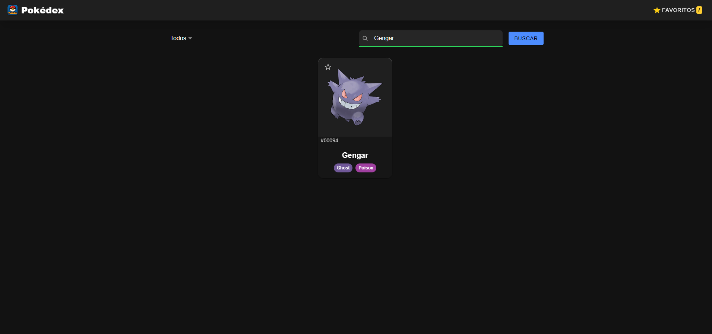

   

# Pokédex App - Ionic Angular

Uma aplicação Pokédex desenvolvida com Ionic e Angular que permite visualizar informações detalhadas dos Pokémons, além da possibilidade de salva-los como favorito.

## Abordagem e Padrões de Design

A criação deste projeto teve como foco uma organização flexível e que se adapta a diferentes telas, visando facilitar futuras atualizações e agradar quem o utiliza. Para a aparência, escolhi o Tailwind CSS, que me ajudou a manter um visual uniforme e a criar layouts adaptáveis com suas ferramentas. Os elementos são organizados de forma que a lógica interna e a parte visual fiquem separadas. Para controlar as informações, usei os serviços do Angular com Observables do RxJS, o que permitiu um controle ágil e reativo dos dados. O código foi escrito seguindo as melhores práticas de programação e conta com carregamento sob demanda para melhorar o desempenho. Além disso, utilizei o TypeScript para garantir mais segurança e facilitar o desenvolvimento com a ajuda do autocompletar.

## Funcionalidades e Interface

Na tela principal, é exibida uma lista paginada com nomes, números e imagens oficiais de alta qualidade, acompanhada de um botão "Carregar Mais" para buscar mais itens de forma eficiente. Ao selecionar um Pokémon, o usuário acessa uma página de detalhes que apresenta informações como altura, peso, tipos (destacados por chips coloridos temáticos), habilidades e estatísticas base com barras de progresso visuais, além de múltiplos sprites (frente, costas e shiny). Há também a opção de marcar Pokémons como favoritos, com uma lista dedicada para visualização, e uma funcionalidade de busca que permite filtrar por nome ou tipo. A interface é projetada com um esquema de cores inspirado nos tipos de Pokémons, animações suaves e feedback visual para ações como carregamento e erros, garantindo responsividade e adaptação a diferentes tamanhos de tela e dispositivos.

## Tecnologias e Integração com APIs

O projeto utiliza um conjunto de tecnologias modernas para desenvolvimento web e mobile. **Ionic 8** e **Angular 19** formam a base da aplicação, enquanto **TypeScript** e **RxJS** para uma tipagem segura e gerenciamento reativo de dados. A estilização é feita com Tailwind, que oferece classes específicas, ajudando na padronização. As informações dos pokemons são coletados da [PokéAPI](https://pokeapi.co/). A integração com a API é otimizada para garantir rapidez e confiabilidade no carregamento dos daods.

## Tecnologias Utilizadas

- **Ionic 8**: Framework para desenvolvimento mobile
- **Angular 19**: Framework web
- **TypeScript**: Linguagem de programação
- **RxJS**: Programação reativa
- **PokéAPI**: API pública para dados dos Pokémons
- **Tailwind CSS**: Facilitar a padronização no estilo

## APIs e Dados

### PokéAPI

- **Lista de Pokémons**: `https://pokeapi.co/api/v2/pokemon`
- **Detalhes do Pokémon**: `https://pokeapi.co/api/v2/pokemon/{id}`
- **Dados completos**: Stats, tipos, habilidades, sprites

### Estrutura de Navegação

- **/** → Redireciona para `/home`
- **/home** → Lista de Pokémons
- **/details/:id** → Detalhes do Pokémon específico

## Características Técnicas

### Arquitetura

A aplicação foi desenvolvida seguindo uma arquitetura modular e escalável. O **lazy loading** é implementado para carregar as páginas apenas quando necessário, reduzindo significativamente o tempo de inicialização da aplicação. Cada página possui seu **próprio módulo**, permitindo um melhor isolamento de recursos e facilitando a manutenção do código. A **lógica de negócio foi centralizada em serviços**, promovendo a reutilização de código e separação de responsabilidades. O uso extensivo do **TypeScript** garante maior segurança durante o desenvolvimento, oferecendo verificação de tipos em tempo de compilação e melhor experiência de desenvolvimento com autocompletar.

### Performance

Para garantir uma experiência fluida, a aplicação implementa um sistema de **paginação inteligente** que carrega apenas 20 Pokémons por vez, evitando sobrecarga na interface e reduzindo o tempo de carregamento inicial. As **imagens são otimizadas** com um sistema de fallback que utiliza sprites menores quando as imagens oficiais de alta qualidade não estão disponíveis, mantendo a velocidade sem comprometer a experiência visual. O **bundle splitting** separa automaticamente o código em chunks distintos para cada página, permitindo que apenas o código necessário seja carregado a cada navegação.

### Responsividade

A interface utiliza o **sistema de grid adaptável do Ionic**, que se ajusta automaticamente a diferentes tamanhos de tela, desde smartphones até tablets e desktops. **Breakpoints personalizados** foram configurados para otimizar o layout em cada tipo de dispositivo, garantindo que o conteúdo seja sempre apresentado de forma adequada. Todos os elementos interativos foram projetados para serem **touch-friendly**, com áreas de toque amplas e feedback visual adequado para dispositivos móveis.

## Demo e Screenshots

### Screenshots

_Tela inicial mostrando a lista de Pokémons com sistema de paginação_

_Página de detalhes exibindo informações completas do Pokémon_

_Lista de Pokémons favoritados pelo usuário_

_Funcionalidade de busca e filtro por tipo_

### Demo em Vídeo

<video width="100%" controls>
   <source src="./docs/video/demo.mp4" type="video/mp4">
   Seu navegador não suporta a tag de vídeo. <a href="./docs/video/demo.mp4">Baixe o vídeo aqui</a>.
</video>

## Documentação Técnica

Uma documentação técnica mais detalhada pode ser encontrada no arquivo [TECHNICAL.md](./docs/TECHNICAL.md), incluindo:

- Fluxo de dados e comunicação com a API
- Estratégias de cache e persistência local
- Padrões de componentes utilizados
- Estratégias de teste
- Guia para desenvolvedores

## Desenvolvedor

Marcos Henrique S. Araújo - Estudante de Análise e Desenvolvimento de sistema. Experiência de desenvolvimento Full Stack utilizando as ferramentas mais modernas da atualidade.

