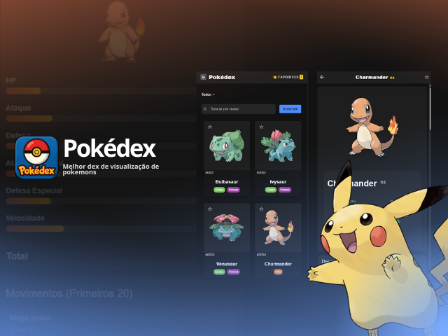

# Pokédex App - Ionic Angular

Uma aplicação Pokédex desenvolvida com Ionic e Angular que permite visualizar informações detalhadas dos Pokémons, além da possibilidade de salva-los como favorito.


## Abordagem e Padrões de Design

A criação deste projeto teve como foco uma organização flexível e que se adapta a diferentes telas, visando facilitar futuras atualizações e agradar quem o utiliza. Para a aparência, escolhi o Tailwind CSS, que me ajudou a manter um visual uniforme e a criar layouts adaptáveis com suas ferramentas. Os elementos são organizados de forma que a lógica interna e a parte visual fiquem separadas. Para controlar as informações, usei os serviços do Angular com Observables do RxJS, o que permitiu um controle ágil e reativo dos dados. O código foi escrito seguindo as melhores práticas de programação e conta com carregamento sob demanda para melhorar o desempenho. Além disso, utilizei o TypeScript para garantir mais segurança e facilitar o desenvolvimento com a ajuda do autocompletar.

## Funcionalidades Implementadas

### Tela Principal (Home)

### Tela de Detalhes

### Interface e UX

## Estrutura do Projeto

```
src/app/
├── home/               # Página principal com lista de Pokémons
│   ├── home.page.html
│   ├── home.page.scss
│   ├── home.page.ts
│   └── home.module.ts
├── details/            # Página de detalhes do Pokémon
│   ├── details.page.html
│   ├── details.page.scss
│   ├── details.page.ts
│   └── details.module.ts
├── services/           # Serviços da aplicação
│   └── pokemon.service.ts
└── app-routing.module.ts
```

## Tecnologias Utilizadas

- **Ionic 8**: Framework para desenvolvimento mobile
- **Angular 19**: Framework web
- **TypeScript**: Linguagem de programação
- **RxJS**: Programação reativa
- **PokéAPI**: API pública para dados dos Pokémons
- **SCSS**: Pré-processador CSS

## APIs e Dados

### PokéAPI

- **Lista de Pokémons**: `https://pokeapi.co/api/v2/pokemon`
- **Detalhes do Pokémon**: `https://pokeapi.co/api/v2/pokemon/{id}`
- **Imagens oficiais**: Artwork de alta qualidade
- **Dados completos**: Stats, tipos, habilidades, sprites

## Como Executar

### Pré-requisitos

- Node.js (versão 18 ou superior)
- npm ou yarn
- Ionic CLI: `npm install -g @ionic/cli`

### Instalação

1. Clone o repositório
2. Instale as dependências:
   ```bash
   npm install
   ```

### Desenvolvimento

```bash
# Servidor de desenvolvimento
ionic serve
# ou
npm start

# Build para produção
ionic build
# ou
npm run build
```

### Estrutura de Navegação

- **/** → Redireciona para `/home`
- **/home** → Lista de Pokémons
- **/details/:id** → Detalhes do Pokémon específico

## Características Técnicas

### Arquitetura

- **Lazy loading**: Páginas carregadas sob demanda
- **Modular**: Cada página tem seu próprio módulo
- **Serviços**: Lógica de negócio centralizada
- **Tipagem**: TypeScript para maior segurança

### Performance

- **Paginação**: Carregamento de 20 Pokémons por vez
- **Imagens otimizadas**: Fallback para sprites menores
- **Bundle splitting**: Chunks separados para cada página

### Responsividade

- **Grid system**: Layout adaptável do Ionic
- **Breakpoints**: Diferentes layouts para mobile/tablet/desktop
- **Touch-friendly**: Botões e áreas de toque otimizadas

## Demo e Screenshots

### Screenshots


_Tela inicial mostrando a lista de Pokémons com sistema de paginação_


_Página de detalhes exibindo informações completas do Pokémon_


_Lista de Pokémons favoritados pelo usuário_


_Funcionalidade de busca e filtro por tipo_

### Demo em Vídeo

[](./docs/video/demo.mp4)
_Clique na imagem acima para assistir ao vídeo de demonstração_

## Documentação Técnica

Uma documentação técnica mais detalhada pode ser encontrada no arquivo [TECHNICAL.md](./docs/TECHNICAL.md), incluindo:

- Fluxo de dados e comunicação com a API
- Estratégias de cache e persistência local
- Padrões de componentes utilizados
- Estratégias de teste
- Guia para desenvolvedores

## Autor

[Marcos H. S. Araújo]("")
